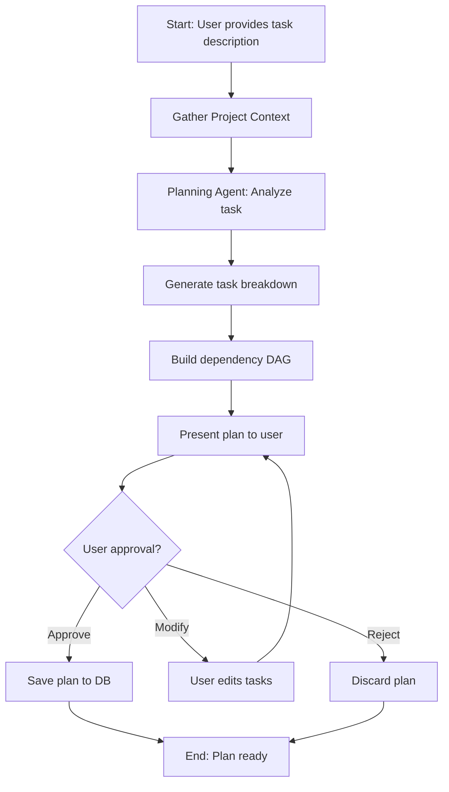
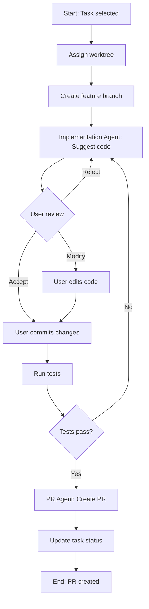

# taskctl - AI-Powered Task Management CLI

詳細仕様書

---

## 1. プロジェクト概要

### 1.1 目的

taskctl は、Mastra フレームワークを使用した AI 駆動のタスク管理 CLI ツールです。Git worktree を活用して並行開発を行い、AI が Google の Small CL (Changelist) プラクティスに基づいてタスクを分割・計画します。

### 1.2 主要な特徴

- **Small CL 分割**: AI が大きなタスクを ~100行程度の小さな変更単位に分割
- **Worktree プール**: 複数の worktree を事前作成し、並行開発を実現
- **依存関係グラフ**: タスク間の依存関係を DAG として管理
- **Human-in-the-loop**: AI が提案し、人間が確認・修正するワークフロー
- **GitHub 統合**: gh CLI を使用した PR 管理

### 1.3 ユースケース

1. **大規模機能開発**: 新機能を小さな PR に分割して段階的にマージ
2. **リファクタリング**: 影響範囲を最小化した安全なリファクタリング
3. **並行タスク実行**: 依存関係のないタスクを複数の worktree で同時進行
4. **チーム開発**: 複数人での協調的な PR レビューフロー

---

## 2. アーキテクチャ

### 2.1 コンポーネント構成

```
┌─────────────────────────────────────────────────────────────┐
│                        CLI Layer                             │
│  (Commander.js)                                              │
│  ┌─────┬─────┬─────┬─────┬─────┬─────┬─────┬─────┐         │
│  │init │plan │task │ wt  │exec │ pr  │status│project│        │
│  └──┬──┴──┬──┴──┬──┴──┬──┴──┬──┴──┬──┴──┬──┴──┬──┘         │
└─────┼─────┼─────┼─────┼─────┼─────┼─────┼─────┼─────────────┘
      │     │     │     │     │     │     │     │
┌─────▼─────▼─────▼─────▼─────▼─────▼─────▼─────▼─────────────┐
│                      Core Services                           │
│  ┌──────────────┐  ┌──────────────┐  ┌──────────────┐       │
│  │   Mastra     │  │  Worktree    │  │  Dependency  │       │
│  │   Agents     │  │  Pool Mgr    │  │  Graph       │       │
│  └──────┬───────┘  └──────┬───────┘  └──────┬───────┘       │
└─────────┼─────────────────┼─────────────────┼───────────────┘
          │                 │                 │
┌─────────▼─────────────────▼─────────────────▼───────────────┐
│                    Data Access Layer                         │
│  ┌──────────────────────────────────────────────────┐       │
│  │              SQLite (LibSQL) + Drizzle ORM       │       │
│  └──────────────────────────────────────────────────┘       │
└─────────────────────────────────────────────────────────────┘
          │                 │
┌─────────▼─────────────────▼─────────────────────────────────┐
│                    External Services                         │
│  ┌──────────────┐  ┌──────────────┐  ┌──────────────┐       │
│  │  Anthropic   │  │  Git CLI     │  │  GitHub CLI  │       │
│  │  Claude API  │  │              │  │  (gh)        │       │
│  └──────────────┘  └──────────────┘  └──────────────┘       │
└─────────────────────────────────────────────────────────────┘
```

### 2.2 ディレクトリ構造

```
src/
├── index.ts                    # CLI エントリーポイント
├── commands/                   # CLI コマンド
│   ├── init.ts                # プロジェクト初期化
│   ├── project.ts             # プロジェクト管理
│   ├── plan.ts                # プラン管理
│   ├── task.ts                # タスク管理
│   ├── worktree.ts            # Worktree 管理
│   ├── pr.ts                  # PR 管理
│   ├── exec.ts                # 実行コマンド
│   └── status.ts              # ステータス表示
├── mastra/                     # Mastra 設定
│   ├── index.ts               # Mastra インスタンス
│   ├── agents/
│   │   ├── planning.ts        # タスク分割 Agent
│   │   ├── implementation.ts  # 実装補助 Agent
│   │   └── pr.ts              # PR 作成 Agent
│   └── workflows/
│       ├── planning.ts        # 計画ワークフロー
│       └── implementation.ts  # 実装ワークフロー
├── db/
│   ├── schema.ts              # SQLite スキーマ (Drizzle)
│   ├── index.ts               # データベース接続
│   ├── migrations/            # マイグレーション
│   └── repositories/          # データアクセス層
│       ├── project.ts
│       ├── plan.ts
│       ├── task.ts
│       ├── worktree.ts
│       └── pr.ts
├── worktree/
│   └── pool-manager.ts        # Worktree プール管理
├── graph/
│   ├── dependency-graph.ts    # DAG 計算
│   └── scheduler.ts           # 実行スケジューラー
├── integrations/
│   ├── git.ts                 # Git 操作
│   └── github.ts              # gh CLI ラッパー
└── utils/
    ├── config.ts              # 設定管理
    ├── paths.ts               # パス解決
    └── id.ts                  # ULID 生成
```

### 2.3 データ保存場所

| データ種別 | 保存場所 |
|-----------|---------|
| グローバル設定 | `~/Library/Application Support/taskctl/config.json` |
| SQLite DB | `~/Library/Application Support/taskctl/taskctl.db` |
| プロジェクト設定 | `<project>/.taskctl/config.json` |
| ログ | `~/Library/Application Support/taskctl/logs/` |

---

## 3. データモデル

### 3.1 ER 図

```
┌─────────────┐       ┌─────────────┐       ┌─────────────┐
│  projects   │       │    plans    │       │   tasks     │
├─────────────┤       ├─────────────┤       ├─────────────┤
│ id (PK)     │◄──┐   │ id (PK)     │◄──┐   │ id (PK)     │
│ name        │   │   │ project_id  │───┘   │ plan_id     │───┐
│ path        │   │   │ title       │       │ title       │   │
│ remote_url  │   │   │ description │       │ description │   │
│ main_branch │   │   │ status      │       │ status      │   │
│ wt_count    │   │   │ created_at  │       │ level       │   │
│ created_at  │   │   │ updated_at  │       │ estimated_  │   │
│ updated_at  │   │   └─────────────┘       │   lines     │   │
└─────────────┘   │                         │ worktree_id │───┼──┐
                  │                         │ created_at  │   │  │
                  │                         │ updated_at  │   │  │
                  │                         └─────────────┘   │  │
                  │                               ▲           │  │
                  │       ┌─────────────┐         │           │  │
                  │       │ task_deps   │         │           │  │
                  │       ├─────────────┤         │           │  │
                  │       │ id (PK)     │         │           │  │
                  │       │ task_id     │─────────┘           │  │
                  │       │ depends_on  │─────────────────────┘  │
                  │       │ created_at  │                        │
                  │       └─────────────┘                        │
                  │                                              │
                  │       ┌─────────────┐       ┌─────────────┐  │
                  │       │  worktrees  │       │    prs      │  │
                  │       ├─────────────┤       ├─────────────┤  │
                  │       │ id (PK)     │◄──────│ id (PK)     │  │
                  └───────│ project_id  │       │ task_id     │──┘
                          │ name        │       │ worktree_id │───┘
                          │ path        │       │ number      │
                          │ branch      │       │ url         │
                          │ status      │       │ status      │
                          │ task_id     │       │ created_at  │
                          │ created_at  │       │ updated_at  │
                          │ updated_at  │       └─────────────┘
                          └─────────────┘
```

### 3.2 テーブル定義

#### projects テーブル

| カラム | 型 | 説明 |
|--------|------|------|
| id | TEXT (ULID) | 主キー |
| name | TEXT | プロジェクト名 |
| path | TEXT | リポジトリのルートパス |
| remote_url | TEXT | リモート URL (nullable) |
| main_branch | TEXT | メインブランチ名 (default: 'main') |
| worktree_count | INTEGER | Worktree 数 (default: 10) |
| created_at | TEXT (ISO8601) | 作成日時 |
| updated_at | TEXT (ISO8601) | 更新日時 |

#### plans テーブル

| カラム | 型 | 説明 |
|--------|------|------|
| id | TEXT (ULID) | 主キー |
| project_id | TEXT | プロジェクト ID (FK) |
| title | TEXT | プラン名 |
| description | TEXT | プランの説明 (nullable) |
| source_branch | TEXT | 作業元ブランチ |
| status | TEXT | ステータス (enum) |
| created_at | TEXT (ISO8601) | 作成日時 |
| updated_at | TEXT (ISO8601) | 更新日時 |

**status enum**: `draft`, `planning`, `ready`, `in_progress`, `completed`, `archived`

#### tasks テーブル

| カラム | 型 | 説明 |
|--------|------|------|
| id | TEXT (ULID) | 主キー |
| plan_id | TEXT | プラン ID (FK) |
| title | TEXT | タスク名 |
| description | TEXT | タスクの詳細説明 |
| status | TEXT | ステータス (enum) |
| level | INTEGER | DAG のレベル (0が最初) |
| estimated_lines | INTEGER | 推定変更行数 (nullable) |
| worktree_id | TEXT | 割り当て Worktree ID (nullable, FK) |
| branch_name | TEXT | ブランチ名 (nullable) |
| created_at | TEXT (ISO8601) | 作成日時 |
| updated_at | TEXT (ISO8601) | 更新日時 |

**status enum**: `pending`, `ready`, `assigned`, `in_progress`, `pr_created`, `in_review`, `completed`, `blocked`

#### task_deps テーブル

| カラム | 型 | 説明 |
|--------|------|------|
| id | TEXT (ULID) | 主キー |
| task_id | TEXT | タスク ID (FK) |
| depends_on_id | TEXT | 依存先タスク ID (FK) |
| created_at | TEXT (ISO8601) | 作成日時 |

**制約**: UNIQUE(task_id, depends_on_id)

#### worktrees テーブル

| カラム | 型 | 説明 |
|--------|------|------|
| id | TEXT (ULID) | 主キー |
| project_id | TEXT | プロジェクト ID (FK) |
| name | TEXT | Worktree 名 (例: myproject0) |
| path | TEXT | Worktree のパス |
| branch | TEXT | 現在のブランチ名 (nullable) |
| status | TEXT | ステータス (enum) |
| task_id | TEXT | 割り当てタスク ID (nullable, FK) |
| created_at | TEXT (ISO8601) | 作成日時 |
| updated_at | TEXT (ISO8601) | 更新日時 |

**status enum**: `available`, `assigned`, `in_progress`, `pr_pending`, `completed`, `error`

#### prs テーブル

| カラム | 型 | 説明 |
|--------|------|------|
| id | TEXT (ULID) | 主キー |
| task_id | TEXT | タスク ID (FK) |
| worktree_id | TEXT | Worktree ID (FK) |
| number | INTEGER | GitHub PR 番号 |
| url | TEXT | PR URL |
| status | TEXT | ステータス (enum) |
| base_branch | TEXT | ベースブランチ |
| head_branch | TEXT | ヘッドブランチ |
| created_at | TEXT (ISO8601) | 作成日時 |
| updated_at | TEXT (ISO8601) | 更新日時 |

**status enum**: `draft`, `open`, `in_review`, `approved`, `merged`, `closed`

---

## 4. CLI コマンド仕様

### 4.1 グローバルオプション

```
--verbose, -v     詳細ログ出力
--quiet, -q       最小限の出力
--help, -h        ヘルプ表示
--version         バージョン表示
```

### 4.2 init コマンド

プロジェクトを taskctl の管理下に置く。

```bash
# ローカルリポジトリを初期化
taskctl init

# リポジトリをクローンして初期化
taskctl init --clone <url>

# Worktree 数を指定
taskctl init --worktrees 5

# メインブランチを指定
taskctl init --main-branch master
```

| オプション | 短縮 | 説明 | デフォルト |
|-----------|------|------|-----------|
| --clone | -c | クローンする URL | - |
| --worktrees | -w | Worktree 数 | 10 |
| --main-branch | -b | メインブランチ名 | main |
| --name | -n | プロジェクト名 | ディレクトリ名 |

**処理フロー**:
1. リポジトリの検証 (git repo であることを確認)
2. `.taskctl/` ディレクトリ作成
3. SQLite にプロジェクト情報を登録
4. Worktree プールを作成

### 4.3 project コマンド

プロジェクト一覧・管理。

```bash
# プロジェクト一覧
taskctl project list

# プロジェクト詳細
taskctl project show [project-id]

# 現在のディレクトリのプロジェクトを表示
taskctl project current

# プロジェクト設定の更新
taskctl project config --worktrees 15

# プロジェクトを削除 (DBから削除、worktreeも削除)
taskctl project remove [project-id] --force
```

### 4.4 plan コマンド

計画の作成・管理。

```bash
# 新規プラン作成
taskctl plan new "<title>" [--description "<desc>"]

# プラン一覧
taskctl plan list [--status <status>]

# プラン詳細
taskctl plan show <plan-id>

# AI でタスク生成
taskctl plan ai generate "<prompt>" [--plan-id <id>]

# AI 生成結果のレビュー
taskctl plan ai review <plan-id>

# AI 生成結果を承認
taskctl plan ai approve <plan-id>

# 依存グラフ表示
taskctl plan graph <plan-id> [--format ascii|mermaid]

# プラン削除
taskctl plan delete <plan-id>

# プランを開始
taskctl plan start <plan-id>
```

**AI generate オプション**:

| オプション | 説明 |
|-----------|------|
| --plan-id | 既存プランに追加 |
| --branch | 作業ブランチ (default: current) |
| --max-lines | タスクあたり最大行数 (default: 100) |
| --context | 追加コンテキストファイル |

### 4.5 task コマンド

タスクの管理。

```bash
# タスク一覧
taskctl task list [--plan-id <id>] [--status <status>]

# タスク詳細
taskctl task show <task-id>

# タスク手動追加
taskctl task add --plan-id <id> --title "<title>" [--depends-on <task-id>...]

# タスク編集
taskctl task edit <task-id> --title "<title>" --description "<desc>"

# タスク削除
taskctl task delete <task-id>

# 依存関係追加
taskctl task depends <task-id> --on <dependency-task-id>

# 依存関係削除
taskctl task undepends <task-id> --on <dependency-task-id>

# タスクを開始 (worktree 割り当て)
taskctl task start <task-id>

# タスクを完了
taskctl task complete <task-id>
```

### 4.6 wt (worktree) コマンド

Worktree プールの管理。

```bash
# Worktree プールを初期化
taskctl wt init [--count <n>]

# Worktree 一覧
taskctl wt list

# Worktree ステータス
taskctl wt status [worktree-id]

# 特定の worktree をリセット
taskctl wt reset <worktree-id>

# 全 worktree をリセット (利用可能状態に戻す)
taskctl wt reset --all

# worktree ディレクトリに移動するコマンドを出力
taskctl wt cd <worktree-id>

# worktree のパスを表示
taskctl wt path <worktree-id>
```

### 4.7 exec コマンド

タスクの実行。

```bash
# 並行実行 (ready なタスクを同時実行)
taskctl exec parallel [--plan-id <id>] [--max-concurrent <n>]

# 単一タスク実行
taskctl exec task <task-id>

# 実行状況確認
taskctl exec status

# 実行停止
taskctl exec stop [--all]
```

**並行実行オプション**:

| オプション | 説明 | デフォルト |
|-----------|------|-----------|
| --plan-id | 対象プラン | 現在のプラン |
| --max-concurrent | 最大同時実行数 | worktree 数 |
| --dry-run | 実行計画のみ表示 | false |

### 4.8 pr コマンド

PR の作成・管理。

```bash
# PR 作成
taskctl pr create <task-id> [--draft] [--title "<title>"]

# PR 一覧
taskctl pr list [--plan-id <id>] [--status <status>]

# PR ステータス更新
taskctl pr sync [task-id]

# PR をマージ
taskctl pr merge <task-id> [--squash]

# PR を閉じる
taskctl pr close <task-id>
```

### 4.9 status コマンド

全体ステータスのダッシュボード表示。

```bash
# 全体ステータス
taskctl status

# 特定プランのステータス
taskctl status --plan-id <id>

# JSON 出力
taskctl status --json
```

**出力例**:

```
Project: my-awesome-app
Plan: Add authentication feature (in_progress)

Tasks:
  Level 0 (parallel):
    ✓ [task_001] Add User model           [completed]
    ✓ [task_002] Add auth middleware      [completed]
  Level 1:
    → [task_003] Add login endpoint       [in_progress] wt:myapp2
    ○ [task_004] Add register endpoint    [ready]
  Level 2:
    ○ [task_005] Add JWT refresh          [pending]

Worktrees:
  myapp0: available
  myapp1: available
  myapp2: in_progress (task_003)
  ...

PRs:
  #12 Add User model        [merged]
  #13 Add auth middleware   [approved]
  #14 Add login endpoint    [in_review]
```

---

## 5. Mastra エージェント仕様

### 5.1 概要

Mastra フレームワークを使用して3つのエージェントを構成。全エージェントは Claude (Anthropic API) を使用。

### 5.2 Planning Agent

**役割**: タスクの分割と依存関係の分析

**入力**:
- プロジェクトの概要 (README, package.json 等)
- 実装対象のブランチまたは機能説明
- 既存のコードベース構造

**出力**:
- Small CL に分割されたタスクリスト
- 各タスクの依存関係 (DAG)
- 推定変更行数

**プロンプト構成**:

```typescript
const planningAgentConfig = {
  name: "planning-agent",
  model: "claude-sonnet-4-20250514",
  instructions: `
    You are a planning agent that helps decompose software development tasks
    into small, reviewable changesets following Google's Small CL best practices.

    Guidelines:
    - Each task should be ~100 lines of code changes
    - Tasks should be atomic and independently testable
    - Identify dependencies between tasks
    - Group parallelizable tasks at the same level
    - Consider: model changes → API → UI order for typical features

    Output format:
    - JSON array of tasks with dependencies
    - Each task has: id, title, description, estimatedLines, dependsOn[]
  `,
  tools: [
    readFileTool,
    listDirectoryTool,
    searchCodeTool,
  ],
};
```

### 5.3 Implementation Agent

**役割**: 実装の補助とコード提案

**入力**:
- タスクの詳細説明
- 関連ファイル
- 依存タスクの実装内容

**出力**:
- 実装提案 (diff 形式)
- 変更が必要なファイル一覧
- テストの提案

**プロンプト構成**:

```typescript
const implementationAgentConfig = {
  name: "implementation-agent",
  model: "claude-sonnet-4-20250514",
  instructions: `
    You are an implementation assistant that helps developers write code
    for specific tasks. You suggest code changes but do not execute them directly.

    Guidelines:
    - Follow existing code style and patterns
    - Keep changes minimal and focused
    - Suggest appropriate tests
    - Consider error handling and edge cases
    - Format output as unified diff when showing changes

    Human-in-the-loop:
    - Always present changes for human review
    - Ask clarifying questions when requirements are ambiguous
    - Provide multiple options when there are trade-offs
  `,
  tools: [
    readFileTool,
    listDirectoryTool,
    searchCodeTool,
    analyzeDependenciesTool,
  ],
};
```

### 5.4 PR Agent

**役割**: PR の作成と管理

**入力**:
- タスク情報
- 変更されたファイル
- 依存 PR 情報

**出力**:
- PR タイトル
- PR 本文 (テンプレートベース)
- ラベル提案

**プロンプト構成**:

```typescript
const prAgentConfig = {
  name: "pr-agent",
  model: "claude-haiku-4-20250514",
  instructions: `
    You are a PR creation assistant that helps write clear, concise
    pull request descriptions.

    Guidelines:
    - Title: [type] Brief description (50 chars max)
    - Types: feat, fix, refactor, docs, test, chore
    - Body: What, Why, How structure
    - Include testing instructions
    - Reference related tasks/issues

    Format:
    ## What
    Brief description of changes

    ## Why
    Motivation and context

    ## How
    Implementation approach

    ## Testing
    How to test these changes
  `,
  tools: [
    readFileTool,
    gitDiffTool,
  ],
};
```

---

## 6. ワークフロー定義

### 6.1 計画ワークフロー (Planning Workflow)



**ステップ詳細**:

1. **Gather Project Context**
   - package.json, README.md の読み込み
   - ディレクトリ構造の取得
   - 既存のプラン・タスクの確認

2. **Planning Agent: Analyze**
   - タスクの分解
   - 依存関係の特定
   - 変更行数の推定

3. **Build Dependency DAG**
   - トポロジカルソート
   - レベル割り当て
   - 循環検出

4. **Human Review**
   - ASCII/Mermaid グラフ表示
   - タスクごとの編集可能
   - 依存関係の調整

### 6.2 実装ワークフロー (Implementation Workflow)



**ステップ詳細**:

1. **Assign Worktree**
   - available な worktree を選択
   - ステータスを assigned に更新
   - task_id を紐付け

2. **Create Feature Branch**
   - `feature/<plan-id>/<task-id>-<slug>` 形式
   - ベースブランチから作成

3. **Implementation Agent Loop**
   - ファイル読み込みと分析
   - 変更提案の生成
   - ユーザーレビュー待ち

4. **User Commits**
   - 人間が最終確認
   - 必要に応じて修正
   - コミット実行

5. **PR Creation**
   - gh CLI で PR 作成
   - 依存 PR へのリンク追加
   - ステータス更新

---

## 7. ユーザーワークフロー

### 7.1 典型的な使用例: 新機能開発

```bash
# 1. プロジェクトを初期化
cd my-project
taskctl init

# 2. 新しいプランを作成
taskctl plan new "Add user authentication"

# 3. AI でタスクを生成
taskctl plan ai generate "
  Implement user authentication with:
  - User model with email/password
  - JWT-based authentication
  - Login/Register/Logout endpoints
  - Auth middleware for protected routes
"

# 4. 生成されたプランを確認
taskctl plan graph 01ARZ3NDEKTSV4RRFFQ69G5FAV

# 出力例:
# Level 0 (parallel):
#   [task_001] Create User model and migration
#   [task_002] Add bcrypt password hashing utility
#
# Level 1 (parallel):
#   [task_003] Implement JWT token service
#   [task_004] Add auth middleware
#
# Level 2 (parallel):
#   [task_005] Create login endpoint
#   [task_006] Create register endpoint
#
# Level 3:
#   [task_007] Create logout endpoint

# 5. プランを承認して開始
taskctl plan ai approve 01ARZ3NDEKTSV4RRFFQ69G5FAV
taskctl plan start 01ARZ3NDEKTSV4RRFFQ69G5FAV

# 6. タスクを並行実行
taskctl exec parallel --max-concurrent 3

# 7. 個別タスクの実装 (対話的)
taskctl task start task_001

# → Worktree が割り当てられる
# → Implementation Agent が実装を提案
# → ユーザーがレビュー・修正
# → コミット

# 8. PR 作成
taskctl pr create task_001

# 9. ステータス確認
taskctl status
```

### 7.2 リモートリポジトリからの開始

```bash
# リポジトリをクローンして初期化
taskctl init --clone https://github.com/org/repo.git

# プランを作成して作業開始
taskctl plan new "Fix performance issues"
taskctl plan ai generate "
  Optimize database queries in the user service:
  - Add missing indexes
  - Implement query caching
  - Fix N+1 queries in user list
"
```

### 7.3 手動タスク管理

```bash
# 手動でタスクを追加
taskctl task add --plan-id <id> --title "Write unit tests for User model"

# 依存関係を設定
taskctl task depends task_008 --on task_001

# タスクを編集
taskctl task edit task_008 --description "Add comprehensive unit tests..."
```

---

## 8. 実装ロードマップ

### Phase 1: 基盤構築 (Week 1-2)

**目標**: 基本的なプロジェクト構造と CLI フレームワーク

**タスク**:
1. TypeScript + Node.js プロジェクトセットアップ
   - package.json
   - tsconfig.json
   - ESLint + Prettier
2. Commander.js による CLI 基盤
   - エントリーポイント
   - グローバルオプション
3. SQLite (LibSQL) + Drizzle ORM セットアップ
   - スキーマ定義
   - マイグレーション
4. 基本コマンド実装
   - `taskctl init`
   - `taskctl project list/show`
   - `taskctl plan new/list/show`

**成果物**:
- 動作する CLI スケルトン
- データベース接続
- 基本的な CRUD 操作

### Phase 2: Worktree 管理 (Week 3)

**目標**: Worktree プールの完全な管理機能

**タスク**:
1. WorktreePoolManager 実装
   - プール初期化
   - 割り当て/解放ロジック
   - ステータス管理
2. Git 操作ユーティリティ
   - worktree 作成/削除
   - ブランチ操作
3. Worktree コマンド実装
   - `taskctl wt init/list/status/reset`

**成果物**:
- 完全な worktree 管理機能
- Git 連携ユーティリティ

### Phase 3: Mastra 連携 (Week 4-5)

**目標**: AI エージェントによるタスク計画機能

**タスク**:
1. Mastra プロジェクトセットアップ
   - Mastra インスタンス
   - Anthropic プロバイダー設定
2. Planning Agent 実装
   - プロンプト設計
   - ツール定義
3. 計画ワークフロー実装
   - コンテキスト収集
   - DAG 生成
   - Human-in-the-loop レビュー
4. Task コマンド拡張
   - `taskctl plan ai generate`
   - `taskctl plan ai review/approve`

**成果物**:
- 動作する Planning Agent
- AI によるタスク分割機能

### Phase 4: 依存関係グラフと実行エンジン (Week 6-7)

**目標**: 依存関係に基づく並行実行

**タスク**:
1. DependencyGraph 実装
   - DAG 構築
   - トポロジカルソート
   - レベル計算
2. Scheduler 実装
   - 実行可能タスクの選択
   - Worktree 割り当て
   - 並行実行制御
3. Implementation Agent 実装
   - コード提案機能
   - 対話的レビュー
4. Exec コマンド実装
   - `taskctl exec parallel`
   - `taskctl exec task`

**成果物**:
- 依存関係グラフ機能
- 並行実行エンジン

### Phase 5: PR 管理と完成 (Week 8)

**目標**: GitHub 連携と全体完成

**タスク**:
1. GitHub CLI 連携
   - PR 作成
   - ステータス取得
   - マージ操作
2. PR Agent 実装
   - PR 本文生成
3. PR コマンド実装
   - `taskctl pr create/list/merge`
4. Status ダッシュボード
   - 全体ステータス表示
   - 進捗可視化
5. ドキュメントとテスト
   - ユーザーガイド
   - E2E テスト

**成果物**:
- 完全な GitHub 連携
- ステータスダッシュボード
- 完成した CLI ツール

---

## 9. 技術的詳細

### 9.1 依存パッケージ

```json
{
  "dependencies": {
    "@mastra/core": "^0.x",
    "@anthropic-ai/sdk": "^0.x",
    "commander": "^12.x",
    "drizzle-orm": "^0.x",
    "@libsql/client": "^0.x",
    "ulid": "^2.x",
    "chalk": "^5.x",
    "ora": "^8.x",
    "inquirer": "^9.x"
  },
  "devDependencies": {
    "typescript": "^5.x",
    "tsx": "^4.x",
    "vitest": "^2.x",
    "@types/node": "^20.x",
    "eslint": "^9.x",
    "prettier": "^3.x"
  }
}
```

### 9.2 環境変数

| 変数名 | 説明 | 必須 |
|--------|------|------|
| ANTHROPIC_API_KEY | Claude API キー | Yes |
| TASKCTL_DB_PATH | DB パス (オーバーライド用) | No |
| TASKCTL_LOG_LEVEL | ログレベル (debug/info/warn/error) | No |

### 9.3 ID 体系

全ての ID は ULID (Universally Unique Lexicographically Sortable Identifier) を使用:
- 時系列でソート可能
- URL safe
- 例: `01ARZ3NDEKTSV4RRFFQ69G5FAV`

### 9.4 ブランチ命名規則

```
feature/<plan-id-short>/<task-id-short>-<slug>
```

例:
```
feature/01ARZ3ND/01ARZ4KY-add-user-model
feature/01ARZ3ND/01ARZ4LM-add-auth-middleware
```

---

## 10. セキュリティ考慮事項

### 10.1 API キー管理
- 環境変数から読み込み
- `.taskctl/` にはクレデンシャルを保存しない
- `.gitignore` に `.taskctl/` を追加推奨

### 10.2 Human-in-the-loop
- AI は提案のみ、実行は人間が行う
- コミット前に必ず差分を確認
- 自動コミット機能は実装しない

### 10.3 Git 操作の安全性
- force push は使用しない
- メインブランチへの直接コミットは禁止
- Worktree は隔離された環境

---

## 11. 今後の拡張可能性

### 11.1 検討中の機能
- GitLab/Bitbucket 対応
- カスタムプロンプトテンプレート
- CI/CD 連携
- コードレビュー自動化
- テスト自動生成

### 11.2 プラグインシステム
将来的にプラグインアーキテクチャを導入し、以下を可能に:
- カスタムエージェント
- 独自ワークフロー
- 外部ツール連携

---

## 付録 A: コマンドリファレンス

完全なコマンド一覧:

```
taskctl init [--clone <url>] [--worktrees <n>] [--main-branch <branch>] [--name <name>]
taskctl project list
taskctl project show [project-id]
taskctl project current
taskctl project config [--worktrees <n>]
taskctl project remove [project-id] [--force]
taskctl plan new "<title>" [--description "<desc>"]
taskctl plan list [--status <status>]
taskctl plan show <plan-id>
taskctl plan ai generate "<prompt>" [--plan-id <id>] [--branch <branch>] [--max-lines <n>] [--context <file>]
taskctl plan ai review <plan-id>
taskctl plan ai approve <plan-id>
taskctl plan graph <plan-id> [--format ascii|mermaid]
taskctl plan delete <plan-id>
taskctl plan start <plan-id>
taskctl task list [--plan-id <id>] [--status <status>]
taskctl task show <task-id>
taskctl task add --plan-id <id> --title "<title>" [--depends-on <task-id>...]
taskctl task edit <task-id> [--title "<title>"] [--description "<desc>"]
taskctl task delete <task-id>
taskctl task depends <task-id> --on <dependency-task-id>
taskctl task undepends <task-id> --on <dependency-task-id>
taskctl task start <task-id>
taskctl task complete <task-id>
taskctl wt init [--count <n>]
taskctl wt list
taskctl wt status [worktree-id]
taskctl wt reset <worktree-id>
taskctl wt reset --all
taskctl wt cd <worktree-id>
taskctl wt path <worktree-id>
taskctl exec parallel [--plan-id <id>] [--max-concurrent <n>] [--dry-run]
taskctl exec task <task-id>
taskctl exec status
taskctl exec stop [--all]
taskctl pr create <task-id> [--draft] [--title "<title>"]
taskctl pr list [--plan-id <id>] [--status <status>]
taskctl pr sync [task-id]
taskctl pr merge <task-id> [--squash]
taskctl pr close <task-id>
taskctl status [--plan-id <id>] [--json]
```

---

## 付録 B: ステータス遷移図

### Task ステータス

```
pending → ready → assigned → in_progress → pr_created → in_review → completed
    ↓                ↓            ↓
  blocked ←────────────────────────
```

### Worktree ステータス

```
available → assigned → in_progress → pr_pending → completed → available
                ↓           ↓            ↓
              error ←───────────────────────
                ↓
            available (reset)
```

### PR ステータス

```
draft → open → in_review → approved → merged
                   ↓           ↓
                closed ←───────
```
